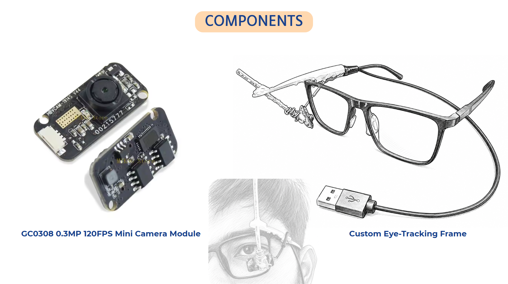

# Eye Tracking Module

**Part of the Augmentative Communication System for Plegia**

This repository contains the **Eye Tracking Module**, a prototype designed to empower individuals with plegia or severe motor disabilities by allowing them to control their computer cursor entirely through eye movements.

**Links:**
*   **[Demonstration Video](https://youtu.be/CbakwJABteQ)**
*   **[Project Presentation](https://canva.link/cap-b)**

## Key Features

*   **Two-Level Calibration System**:
    *   **Level 1 (Precision Calibration)**: Fully automatic 9-point initial calibration with a 4-second Lissajous warm-up animation and auto-dwell tracking (2-second approach ring and 1.5-second countdown arc). No manual keypresses required.
    *   **Level 2 (Fine-Tuning)**: A secondary precision fine-tuning pass (`Ctrl+T` or menu option) to refine the initial calibration mapping for maximum cursor accuracy.
    *   **Advanced Mathematics**: Uses **Bivariate Degree-2 Polynomial Regression** for highly accurate eye-to-screen mapping (significantly improved over standard affine transformations).
    *   **Quality Control**: Tukey IQR outlier rejection per point to ensure stable readings, complete with real-time quality flash indicators (green/amber) and a 4-point validation pass with pixel-error reporting.
*   **Robust Pupil Detection**: Integrates the exact, unchanged Orlosky pupil detection algorithm for bit-for-bit identical accuracy in varied lighting conditions.
*   **Advanced Cursor Control**:
    *   Direct Windows cursor manipulation using `ctypes` (no external libraries needed).
    *   Exponential smoothing for fluid cursor movement.
    *   **Blink Grace Period**: Temporarily pauses cursor updates during natural blinking to prevent erratic jumps.
*   **Premium Control Panel (`launcher.py`)**:
    *   A sleek, dark-themed Tkinter launcher with a comprehensive menu bar.
    *   Status panel with color-coded health indicators for camera, calibration, and cursor-control.
    *   Profile management: Save, rename, delete, and view calibration data.

---

## Hardware Specifications

The system utilizes the following custom hardware setup for robust and high-speed pupil tracking:

*   **Camera Module**: `GC0308 0.3MP 120FPS Mini Camera Module`. A high-framerate, lightweight miniature camera that captures real-time footage of the eye with minimal latency.
*   **Mounting**: **Custom Eye-Tracking Frame**. A specialized, wearable eyeglass frame fitted with an adjustable mount that positions the GC0308 camera module closely to the user's eye.



---

## Software Architecture

The module is modularly designed with the following core components:

*   **`launcher.py`**: The main entry point. Provides the GUI control panel to manage settings, calibrations, and launch the eye tracker.
*   **`gaze_mouse.py`**: The core controller that links pupil detection, the calibration engine, and Windows cursor movement. 
*   **`calibration_engine.py`**: Handles the mathematics, outlier rejection, and polynomial regression for accurate eye-to-screen coordinate mapping.
*   **`calibration_overlay.py`**: Renders the visual overlay (Lissajous curves, countdown arcs) used during the 9-point calibration process.
*   **`OrloskyPupilDetector.py`**: The core computer vision pipeline for isolating and detecting the darkest area (pupil) in the frame.
*   **`settings_window.py`**: A Tkinter-based interface for adjusting system parameters (DPI, gain, smoothing alpha, blink grace period, etc.).
*   **`gaze_controller.py`**: Manages higher-level gaze interactions and state.

---

## Installation & Setup

1. **Clone the repository:**
   ```bash
   git clone <repository-name>
   cd <repository-name>
   ```

2. **Install the required dependencies:**
   It is recommended to use a Python virtual environment.
   ```bash
   pip install -r requirements.txt
   ```
   *Dependencies include: `numpy>=2.1`, `opencv-python>=4.8`, `matplotlib`, `pywin32`.*

---

## Usage Instructions

### Starting the System
Launch the main control panel by running:
```bash
python launcher.py
```
From the control panel, you can start cursor control, manage calibration profiles, and adjust settings.

### In-App Keyboard Controls
When the Eye Tracking Module is running, the following hotkeys are available:
*   `c` - Start Level 1 precision calibration (fully automatic — just follow the dot)
*   `t` - Start Level 2 fine-tuning calibration
*   `r` - Reset calibration
*   `d` - Toggle debug overlay (shows pupil detection and metrics)
*   `s` - Open settings window
*   `-` / `+` - Decrease / Increase cursor gain (speed)
*   `[` / `]` - Increase / Decrease smoothing (alpha)
*   `q` - Quit the application

### Calibration Profiles
Profiles are automatically saved in the `data/` directory as JSON files (e.g., `data/default.json`). You can manage these profiles directly from the "Calibration" menu in the Launcher.
